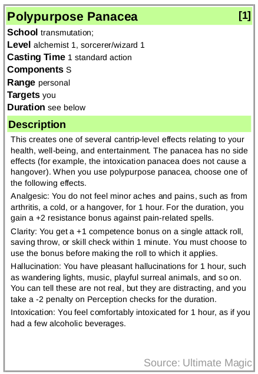

# HTML Card Generator
This is a card generator using HTML+JavaScript+CSS. The generated cards can be viewed and exported (as PDF) via a web browser. The individual card format (60x89mm) fits inside regular euro card sized sleeves.



## Usage
* To view the cards open the HTML `pf-cards.html` with a web browser (tested with Firefox).
* To add and edit cards open the JavaScript file `pf-cards.js` with a text editor.
* To change and edit the card's color style edit the style sheet `card-style.css`.

## Cards
All cards are in the JS array `cards` of dictionaries in the JavaScript file `pf-cards.js`. Each dictionary represents one card. The entries of the dictionary are

| Name              | Descrption                            | Hide |
| ----------------- | --------------------------------------| ---- |
| `name`            | The card's title                      | no   |
| `level`           | The card's level and card style       | no   |
| `text`            | The card's main text                  | no   |
| `source`          | The card's source with label "Source" | no   |
| `school`          | Text with label "School"              | yes  |
| `sub-school`      | Text in parentheses after `school`    | yes  |
| `school-type`     | Text in brackets after `school`       | yes  |
| `casting-time`    | Text with label "Casting Time"        | yes  |
| `components`      | Text with label "Components"          | yes  |
| `range`           | Text with label "Range"               | yes  |
| `sub-range`       | Text in parentheses after `range`     | yes  |
| `effect`          | Text with label "Effect"              | yes  |
| `target`          | Text with label "Targets"             | yes  |
| `duration`        | Text with label "Duration"            | yes  |
| `saving`          | Text with label "Saving Throw"        | yes  |
| `resist`          | Text with label "Spell Resistance"    | yes  |
| `short`           | A short description text              | yes  |
Each dictionary for a card needs all entries, but some features are only visible on the card if the text string is not empty.

The function `genDict` can be used to generate a valid dictionary. The first argument to the function is a dictionary with all desired entries. The default for all optional parameters is an empty string. Additionally, one can pass a template dictionary as second argument to the function. This can be helpful to group cards with similar entries.

```
genDict({'name':'My Card','text':'My card text.','level':'0'}, my_common_card_features)
```

### Card Color / Style
The color for each card is determeined by its `level` entry. The dictionary `css_color_level` is used as look-up table to translate the `level` text into a CSS style label. For each `level` value used there must be an entry in the look-up table. An empty or invalied value for a CSS style results in a gray styled card.
The available CSS styles are defined in the style sheet `card-style.css`. All card styles have the form

```
.LABEL h1,.LABEL h2 {
  color:      #000000 !important;
  background: #96C4FF !important;
}
```
where `LABEL` is the placeholder for the style label used in the look-up table, `color` the foreground color of the headdings, `background` the background color of the headdings. Both colors are in RGB Hex.